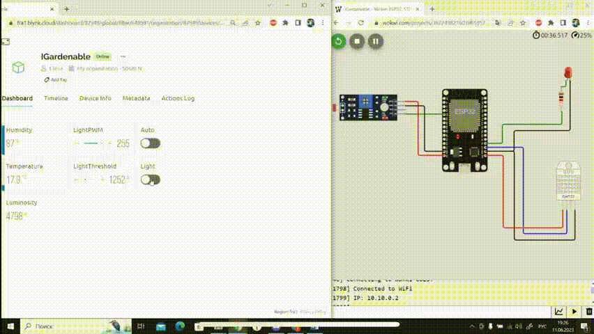

<h1 align="center">IGardenable</h1>
 
## Демонстарция проекта

- Изменения состояния тепличной среды отображаются в приложении пользователя (Blynk)

(температура в градусax Цельсия, влажность в процентах, освещенность в люксах)

- Есть возможность ручного управления светом в теплице.

- Есть возможность ручного управления яркостью света в теплице.

При помощи карточки LightPWM можно установить яркость освещения, где 0 - минимальная яркость, когда лампочка не горит, 255 - максимально возможная яркость.

- Также присутствует авторежим, при котором в теплице автоматически включается искусственный свет при недостатке естественного освещения.

В карточке LightThreshold можно установить пороговое значение освещенности. Если текущее значение освещенности ниже порогового, то автоматически включается свет, если выше - выключается.

___

## Полезные ссылки

[Симулятор темплицы в Wokwi](https://wokwi.com/projects/367243821603961857)
___